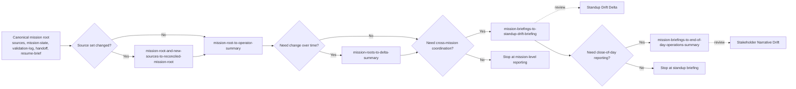
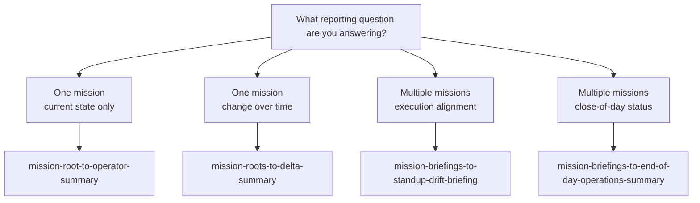
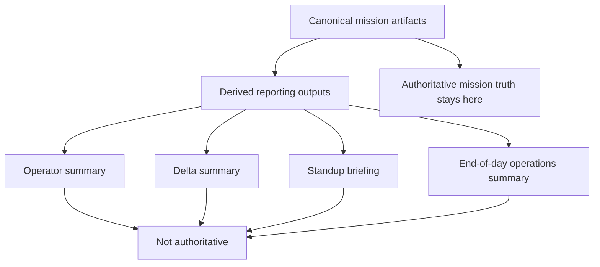

# Autonomous Mission Reporting Playbook: Mermaid View

This file is the visual companion to `.github/workflows/autonomous-mission-reporting-playbook.md`.

Use it when you want the reporting sequence in one glance before reading the fuller operational recipe.

For broader workflow navigation, also see:

- `.github/workflows/customization-system-map.md`
- `.github/workflows/README.md`

## Reporting Layer Overview

The autonomous reporting layer turns canonical mission roots into derived coordination outputs for current-state review, change-over-time comparison, standup alignment, and end-of-day reporting.

Authoritative mission truth still remains in the canonical mission artifacts, not in the derived reporting outputs shown below.

## Canonical Vs Derived

- Canonical mission roots remain authoritative for mission truth.
- The diagrams below describe derived reporting outputs only.

## Reporting Sequence

## Decision Guide

## Authority Rule

