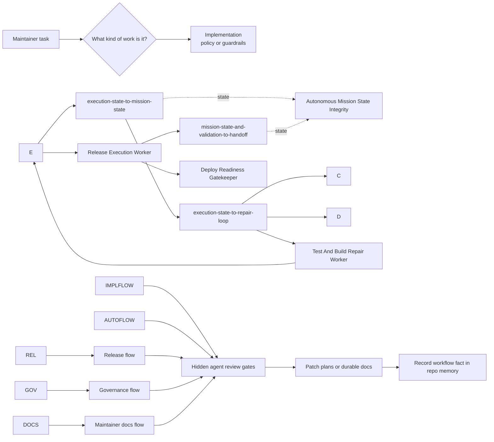
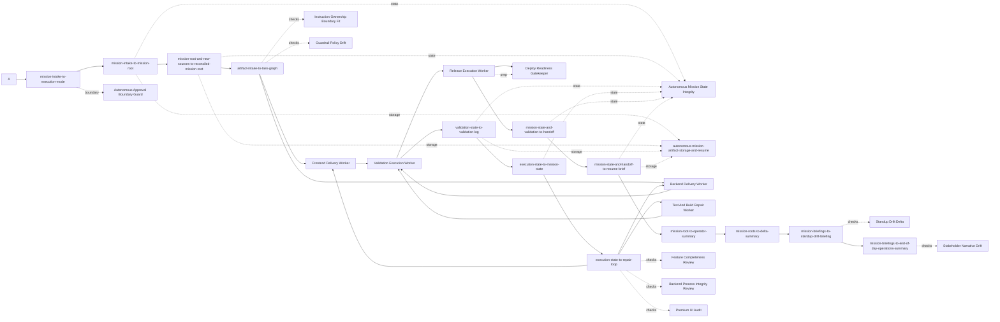
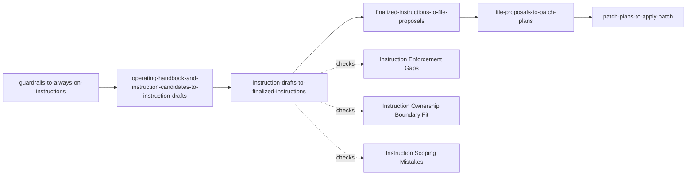
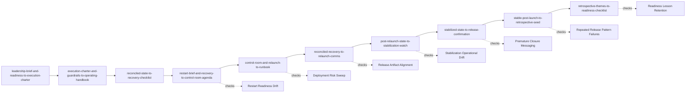
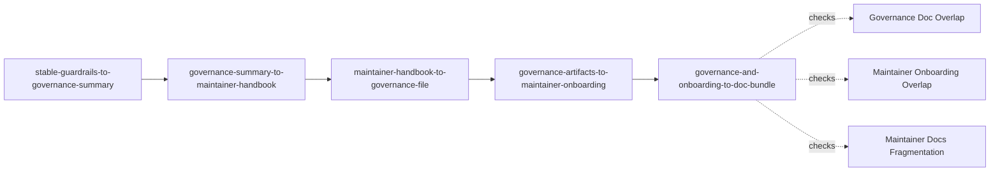
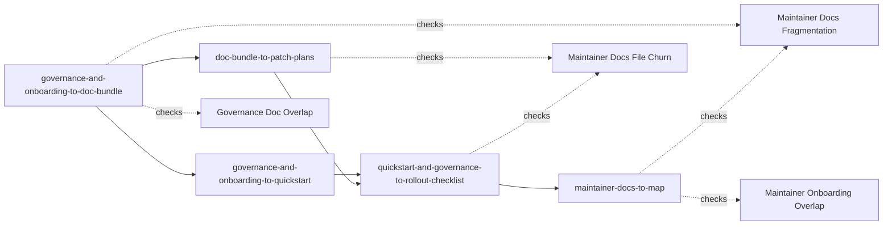
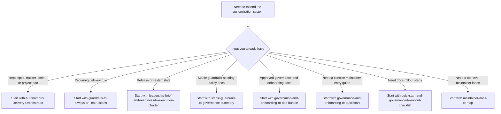

# BPI Customization System Map: Mermaid View

This file is the visual companion to `.github/workflows/customization-system-map.md`. It gives maintainers a quick diagram view of the same layers, flows, and starting points.

## Layer Diagram

```mermaid
flowchart TD
    I[Instructions\nPermanent guardrails] --> S[Skills\nReusable domain standards]
    S --> P[Prompts\nArtifact-to-artifact transformers]
    P --> A[Hidden Agents\nRead-only review gates]
    A --> M[Memory\nRepo continuity and retained decisions]

    I --> IFILES[.github/copilot-instructions.md\n.github/instructions/*]
    S --> SFILES[.github/skills/premium-ui-coherence/SKILL.md]
    P --> PFILES[.github/prompts/*]
    A --> AFILES[.github/agents/*]
    M --> MFILES[/memories/repo/ui-design.md]
```

## Flow Overview
    A --> B[artifact-intake-to-task-graph]


## Autonomous Delivery Flow



Starting agent and prompt:

- `.github/agents/autonomous-delivery-orchestrator.agent.md`
- `.github/prompts/mission-intake-to-execution-mode.prompt.md`
- `.github/prompts/mission-intake-to-mission-root.prompt.md`
- `.github/prompts/mission-root-and-new-sources-to-reconciled-mission-root.prompt.md`
- `.github/prompts/artifact-intake-to-task-graph.prompt.md`
- `.github/prompts/validation-state-to-validation-log.prompt.md`
- `.github/prompts/execution-state-to-mission-state.prompt.md`
- `.github/prompts/mission-state-and-validation-to-handoff.prompt.md`
- `.github/prompts/mission-state-and-handoff-to-resume-brief.prompt.md`
- `.github/prompts/mission-root-to-operator-summary.prompt.md`
- `.github/prompts/mission-roots-to-delta-summary.prompt.md`
- `.github/prompts/mission-briefings-to-standup-drift-briefing.prompt.md`
- `.github/prompts/mission-briefings-to-end-of-day-operations-summary.prompt.md`

Hard gate reference:

- `.github/workflows/autonomous-delivery-definition-of-done.md`

Control reference:

- `.github/workflows/autonomous-execution-modes-and-approval-boundaries.md`

Continuity reference:

- `.github/workflows/autonomous-mission-state-and-handoffs.md`

Storage and resume reference:

- `.github/workflows/autonomous-mission-artifact-storage-and-resume.md`

Related navigation for autonomous reporting:

- `.github/workflows/autonomous-mission-reporting-playbook.md`
- `.github/workflows/autonomous-mission-reporting-playbook-mermaid.md`
- `.github/missions/examples/reporting/`

## Autonomous Reporting Surfaces

Use this grouped navigation when you want to jump straight into the reporting layer:

- `.github/workflows/autonomous-mission-reporting-playbook.md`
- `.github/workflows/autonomous-mission-reporting-playbook-mermaid.md`
- `.github/missions/examples/reporting/`

## Canonical Vs Derived

- Canonical mission roots remain authoritative for mission truth.
- The reporting surfaces above describe derived coordination outputs only.

## Implementation Flow



Starting prompt:

- `.github/prompts/guardrails-to-always-on-instructions.prompt.md`

## Release And Recovery Flow



Starting prompt:

- `.github/prompts/leadership-brief-and-readiness-to-execution-charter.prompt.md`

## Governance Flow



Starting prompt:

- `.github/prompts/stable-guardrails-to-governance-summary.prompt.md`

## Maintainer Docs Flow



Starting prompts by input state:

- `.github/prompts/governance-and-onboarding-to-doc-bundle.prompt.md`
- `.github/prompts/governance-and-onboarding-to-quickstart.prompt.md`
- `.github/prompts/quickstart-and-governance-to-rollout-checklist.prompt.md`
- `.github/prompts/maintainer-docs-to-map.prompt.md`

## Maintainer Routing Summary

